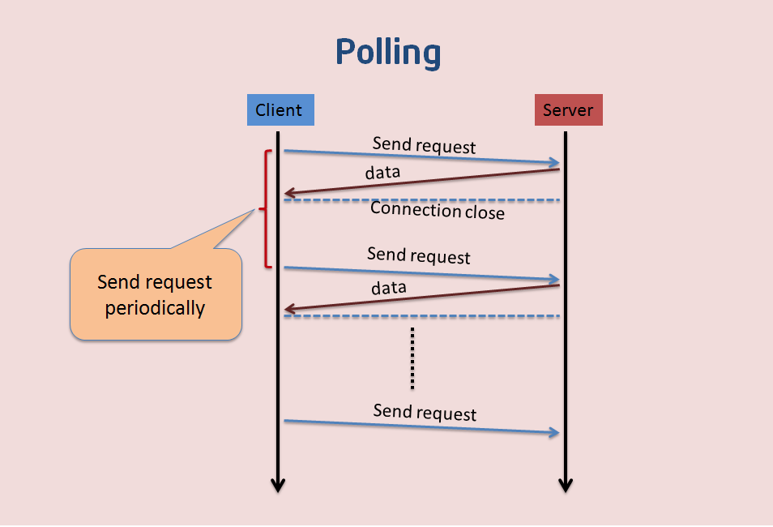
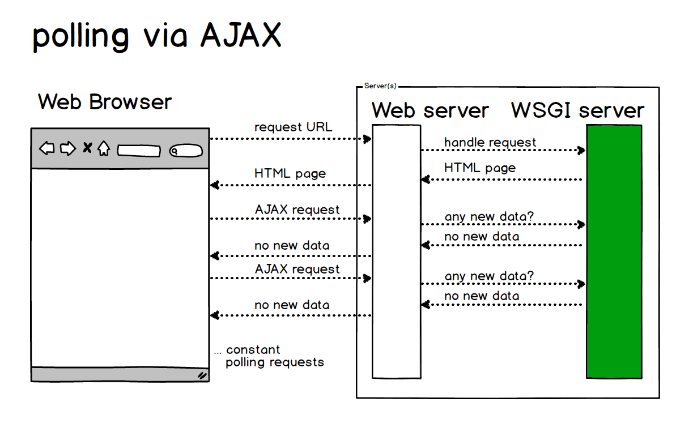
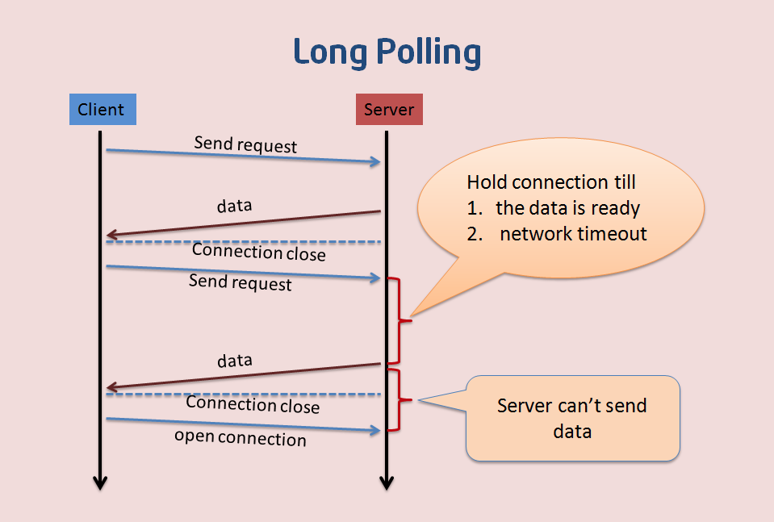
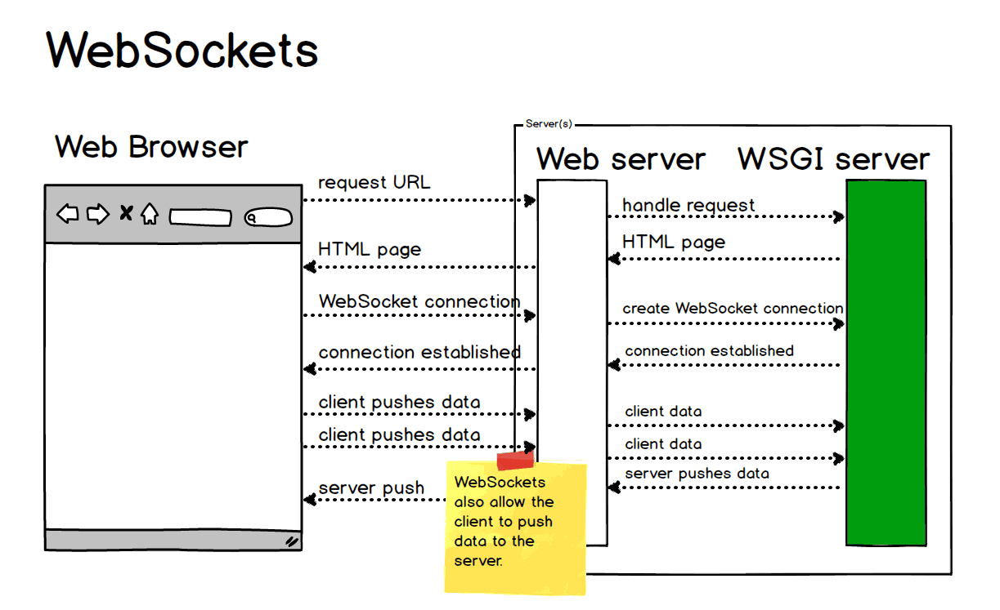

# WebSocket进行聊天

如果使用 Tornado 仅仅做普通的短连接 Web 站点开发就有点大材小用了。

Tornado 很早就加入了对 WebSocket 的支持，可以用来进行长连接的通信。

# 1.websocket介绍

WebSocket 是一种网络通信协议。在 2009 年诞生，于 2011 年被 IETF 定为标准 RFC 6455 通信标准。WebSocket API 也被 W3C 定为标准。

WebSocket 是 HTML5 开始提供的一种在单个 TCP 连接上进行全双工 (full-duplex) 通讯的协议。没有了 Request 和 Response 的概念，两者地位完全平等，连接一旦建立，就建立了持久性连接，浏览器和服务器双方可以随时向对方发送数据。

HTML5 是 HTML 最新版本，包含一些新的标签和全新的 API。HTTP 是一种协议，目前最新版本是 HTTP/2 ，所以 WebSocket 和 HTTP 有一些交集，两者相异的地方还是很多。两者交集的地方在 HTTP 握手阶段，握手成功后，数据就直接从 TCP 通道传输。

# 2.web上的即使通信

在没有 WebSocket 之前，服务器很难主动向客户端推送数据。

Web 为了实现即时通信，经历了最初的 polling, 到之后的 Long polling，等若干种方式。

1. 短轮询 Polling

   

这种方式下，是不适合获取实时信息的，客户端和服务器之间会一直进行连接，每隔一段时间就询问一次。客户端会轮询，有没有新消息。这种方式连接数会很多，一个接受，一个发送。而且每次发送请求都会有 HTTP 的 Header，会很耗流量，也会消耗 CPU 的利用率。

在 Web 端，短轮询用 AJAX JSONP Polling 轮询实现。



- 优点：短连接，服务器处理简单，支持跨域、浏览器兼容性较好。
- 缺点：有一定延迟、服务器压力较大，浪费带宽流量、大部分是无效请求。

2.长轮询 Long Polling



长轮询是对轮询的改进版，客户端发送 HTTP 给服务器之后，有没有新消息，如果没有新消息，就一直等待。直到有消息或者超时了，才会返回给客户端。消息返回后，客户端再次建立连接，如此反复。这种做法在某种程度上减小了网络带宽和 CPU 利用率等问题。

这种方式也有一定的弊端，实时性不高。如果是高实时的系统，肯定不会采用这种办法。因为一个 GET 请求来回需要 2个 RTT，很可能在这段时间内，数据变化很大，客户端拿到的数据已经延后很多了。

- 优点：减少轮询次数，低延迟，浏览器兼容性较好。
- 缺点：服务器需要保持大量连接。

3.WebSocket



为了解决其他机制的各种问题，人们设计出了 WebSocket 协议。

WebSocket 是 HTML5 开始提供的一种独立在单个 TCP 连接上进行全双工通讯的有状态的协议 (它不同于无状态的 HTTP)，并且还能支持二进制帧、扩展协议、部分自定义的子协议、压缩等特性。

### 与普通的HTTP协议的异同

1. WebSocket 协议的 URL 是 `ws://` 或者 `wss://` 开头的，而不是 `HTTP://` 或者 `HTTPS://`

2. WebSocket 使用与普通 HTTP 或 HTTPS 协议相同的 80 端口和 443 端口进行连接

3. WebSocket 的 Header 中有连个特殊字段, 代表它是由 HTTP 协议升级为 WebSocket 协议

   ```
   Connection: Upgrade
   Upgrade: websocket
   ```

### 通过 JS 建议一个简单的 WebSocket 连接

```
var ws = new WebSocket('ws://example.com/socket');
ws.onopen = function () {
    ws.send("Connection established. Hello server!");
}
ws.onmessage = function(event) {
  console.log('client recv: ', event.data)
};
ws.onclose = function () { ... }
ws.onerror = function (error) { ... }
```

### Tornado 中使用 WebSocket

```
class WebsockHandler(tornado.websocket.WebSocketHandler):
    def open(self):
        '''该方法处理建立连接时执行的操作'''
        pass

    def on_close(self):
        '''该方法处理断开连接时执行的操作'''
        pass

    def on_message(self, message):
        '''该方法处理收到消息时进行的操作'''
        pass

    def write_message(self, message):
        '''该方法可以给其他人发送消息'''
        pass
```

